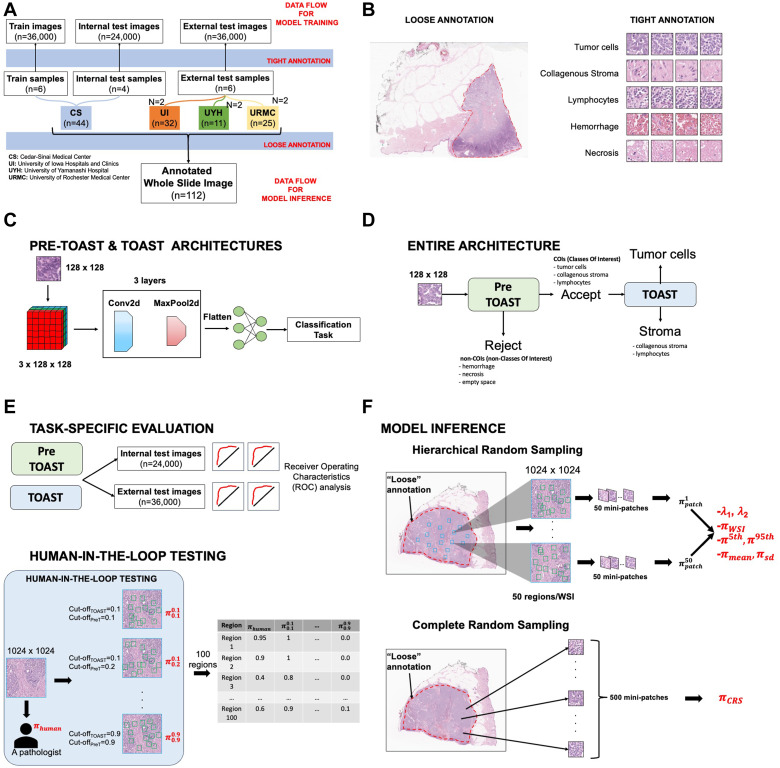

# AI-Based Parameterization of the Stromal Landscape in Merkel Cell Carcinoma (Pre-TOAST & TOAST)

This repository hosts an AI framework developed for automated characterization of the tumor-stroma landscape in Merkel Cell Carcinoma (MCC) using whole-slide histology images. Leveraging deep learning and probabilistic modeling, our approach enables precise tumor-stroma ratio (TSR) estimation and novel tumor-stroma landscape (TSL) classification, both linked to patient prognosis.

## Key Features

- Two-stage AI modeling:
  - **Pre-TOAST/TOAST:** Mini-patch classification model distinguishing tumor cells, collagenous stroma, and lymphocytes from other tissue components.
  - Estimation of TSR and spatial TSL parameters using maximum-likelihood algorithms.
- Hierarchical random sampling of slide regions ensures robust spatial characterization.
- Multi-institutional dataset of 112 MCC cases for extensive validation.
- Superior prognostic stratification with TSL clusters compared to traditional TSR measures.

## Performance Highlights

- Classification AUC: 1.00 for Pre-TOAST distinguishing tissue classes, 0.93 for TOAST distinguishing tumor from stroma.
- AI-based TSR high subgroup strongly associated with shorter metastasis-free survival (P = .029), outperforming pathologist-assessed TSR.
- Spatial clustering analysis revealed two distinct TSL groups with significant survival differences, demonstrating improved prognostic value.

## Why This Framework?

This AI-driven stromal landscape parameterization surpasses human pathology assessment in prognostic performance for MCC and provides a reproducible, quantitative tool for cancer microenvironment analysis. The framework supports large-scale, multi-institutional studies and precision oncology applications.

---

## Getting Started

Installation instructions, data requirements, and usage examples to be added here.

## Citation

If you use this framework in your research, please cite:

> [https://www.sciencedirect.com/science/article/pii/S0023683724018014?via%3Dihub]

---

For questions, bug reports, or contributions, please open an issue or contact the repository maintainer.
